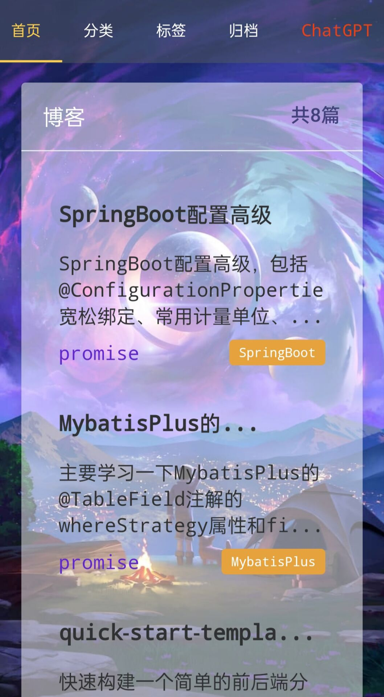
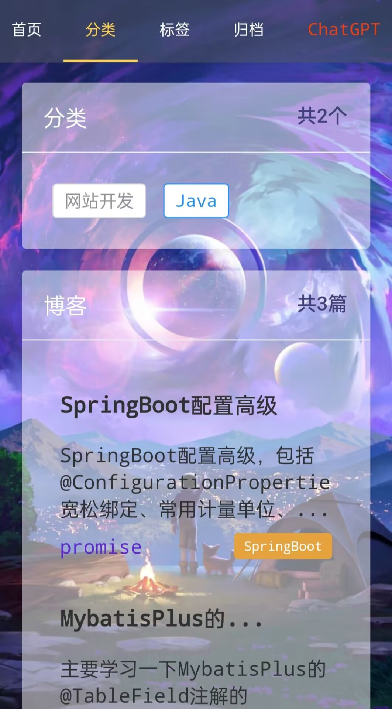
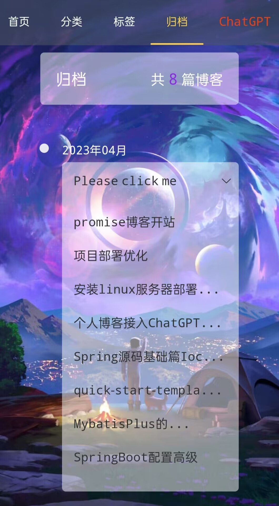
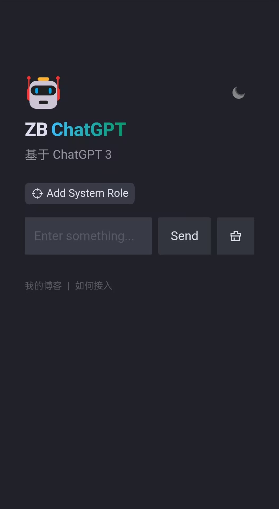
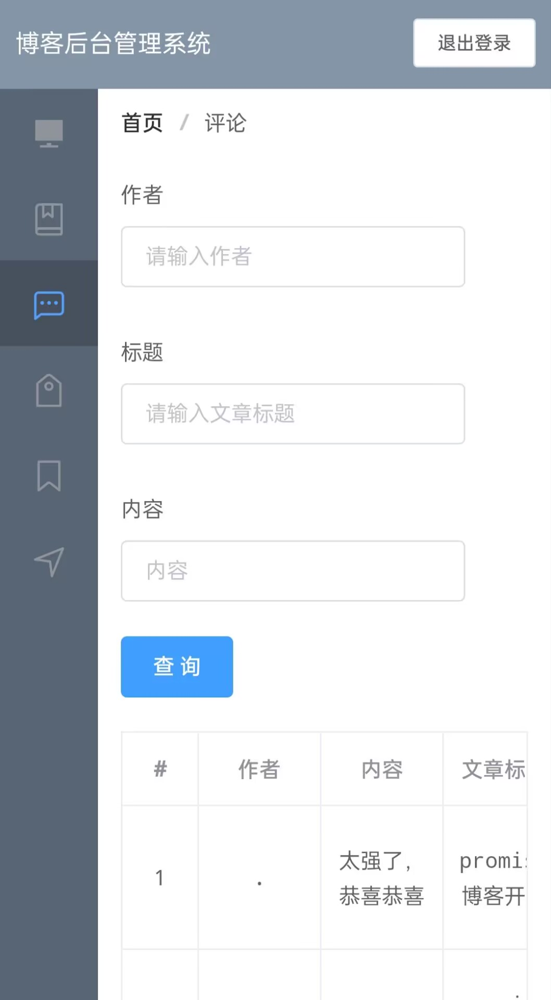

# blog-vue
一个深色系的个人博客前端项目🚀🚀，没有哪个程序员可以抵挡得住深色主题😀，该项目整体是一个前后端分离的个人博客项目，后端项目地址是：https://github.com/zhangb-top/blog

## 项目技术栈

后端：SpringBoot+Spring+mybatis

前端：html+css+js+element-ui+Vue+VueRouter+Vuex

项目展示地址：http://www.zhangb.top ，如果访问不了请联系我，我会修改地址，qq：2629739216

## 项目功能

实现了发布博客、评论博客、分类分标签管理、归档查询、后台管理评论、管理标签、管理分类等功能，同时适配移动端和客户端。

## 页面展示

1. 客户端前台页面

   - 首页

     

   - 分类页

     

   - 标签页

     

   - 归档页

     

2. 移动端前台页面

   - 首页

     

   - 分类页

     

   - 归档页

     

   - chatGPT聊天页

     

3. 后台管理系统

   

   

## 联系我

 
